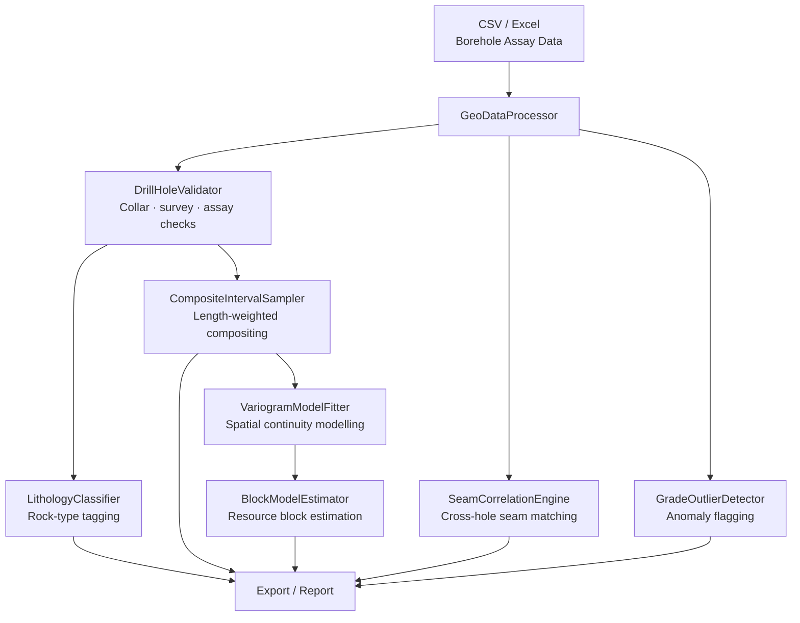

# Geological Data Processor

Borehole data processing, resource estimation, and JORC 2012 classification for mineral and coal exploration campaigns.

## Features

- **Borehole data processing** — load, validate, and preprocess assay data (CSV/Excel)
- **Interval compositing** — length-weighted grade averaging to fixed composite lengths
- **Borehole summary** — depth, interval count, max/avg/weighted-average grade per hole
- **Grade-tonnage curve** — sensitivity of tonnage and contained metal to cutoff grade
- **Resource estimation** — in-situ tonnes, weighted-average grade, contained metal
- **JORC 2012 classification** — Measured / Indicated / Inferred based on drill spacing
- **Tonnage estimation** — area × thickness × bulk density for orebody volume
- **Grade outlier detection** — flag anomalous assay intervals

## Installation

**Step 1: Clone the repository**
```bash
git clone https://github.com/achmadnaufal/geological-data-processor.git
cd geological-data-processor
```

**Step 2: Install dependencies**
```bash
pip install -r requirements.txt
```

## Usage

**Step 3: Run the demo**
```bash
python3 demo/run_demo.py
```

**Step 4: Use in your own code**
```python
from src.main import GeoDataProcessor

proc = GeoDataProcessor(config={"density_t_m3": 1.75, "cutoff_grade": 0.3})
df = proc.load_data("sample_data/borehole_assay.csv")

summary   = proc.borehole_summary(df)
resources = proc.estimate_resources(df, grade_col="grade_pct", cutoff_grade=0.3)
gtc       = proc.grade_tonnage_curve(df)
jorc      = proc.classify_resource_confidence(df, drill_spacing_m=50.0)
tonnage   = proc.estimate_tonnage(df, area_sqm=250000, avg_thickness_m=4.5)
```

**Step 5: View results**
All methods return DataFrames or dicts — pipe to `.to_csv("output.csv")` for export.

## Data Format

Expected CSV columns:
```
hole_id, from_m, to_m, grade_pct, lithology, rock_code
```

## Example Output

```
$ python3 demo/run_demo.py
==============================================================
  Geological Data Processor — Demo
==============================================================

✓ Loaded 19 borehole intervals from borehole_assay.csv
  Drill holes : 4
  Grade range : 0.05% – 2.31%
  Lithologies : ['Coal', 'Interburden', 'Overburden']

✓ Borehole Summary:
  Hole ID    Depth (m)  Intervals  Max Grade  Wtd Avg Grade
  ----------------------------------------------------------
  BH001            6.0          6      1.28%          0.61%
  BH002            6.0          4      2.31%          1.11%
  BH003            6.0          4      1.82%          0.85%
  BH004            6.0          5      1.67%          0.87%

✓ Resource Estimate (cutoff grade: 0.3%):
  Intervals above cutoff : 13
  In-situ tonnage        : 28,875 t
  Weighted avg grade     : 1.2024%
  Contained metal        : 347.2 t
  Grade distribution     :
    p10: 0.4420%  p25: 0.6200%  p50: 0.9500%
    p75: 1.4500%  p90: 1.7900%

✓ Grade-Tonnage Curve (sensitivity to cutoff):
   Cutoff %       Tonnes  Avg Grade %  Contained t
  -------------------------------------------------
     0.0000         42.0      0.8633%         0.36
     0.4620         23.6      1.3756%         0.32
     0.9240         17.5      1.5970%         0.28
     1.3860         12.2      1.8029%         0.22

✓ JORC 2012 Resource Classification (50m drill spacing):
  Classification  : INDICATED
  Confidence score: 65.0/100
  Rationale       : Moderate drill spacing — sufficient for Indicated resource estimation

✓ Tonnage Estimation (250,000 m² × 4.5 m seam):
  Volume          : 1,125,000 m³
  In-situ tonnage : 1,518,750 t
  Avg grade       : 0.787%
  Contained metal : 11,950 t

==============================================================
  ✅ Demo complete
==============================================================
```

## Architecture



## Testing

```bash
pytest tests/ -v
```

---

> Built by [Achmad Naufal](https://github.com/achmadnaufal) | Lead Data Analyst | Power BI · SQL · Python · GIS
