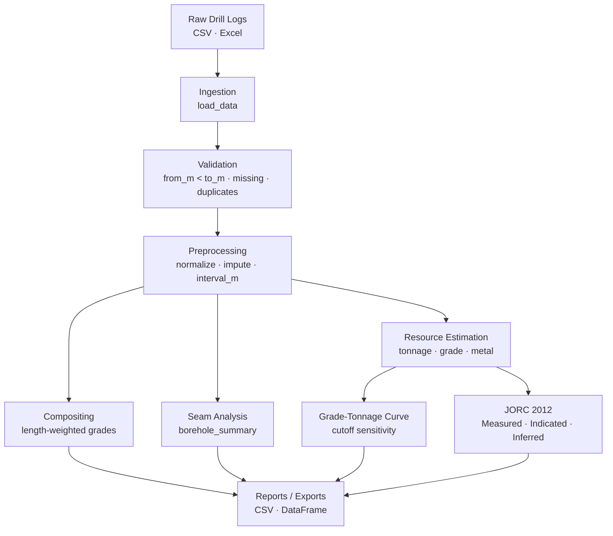

# Geological Data Processor

Geological data processing toolkit for coal and mineral exploration — ingests raw drill logs, runs quality checks on assay intervals, composites samples, and produces seam-level summaries, grade-tonnage curves, and JORC 2012 resource classifications. Built to turn messy borehole CSVs into reportable numbers for coal mining and pit-planning workflows.

## Features

- **Drill-log ingestion** — load borehole assay data from CSV / Excel with column normalization
- **Validation & QA** — interval sanity checks (from_m < to_m), missing-value imputation, duplicate detection
- **Seam analysis** — per-hole summaries: total depth, interval count, max grade, length-weighted avg grade
- **Interval compositing** — re-composite variable-length samples to fixed composite lengths (length-weighted)
- **Grade-tonnage curve** — sensitivity of tonnage and contained metal/coal to a sweep of cutoff grades
- **Resource estimation** — in-situ tonnage, weighted-avg grade, contained metal with grade percentiles (p10–p90)
- **JORC 2012 classification** — Measured / Indicated / Inferred based on drill spacing and sample density
- **Tonnage estimation** — area × thickness × bulk density for pit or seam volume calculations

## Quick Start

```bash
git clone https://github.com/achmadnaufal/geological-data-processor.git
cd geological-data-processor
pip install -r requirements.txt
python3 demo/run_demo.py
```

## Usage

Run the bundled demo against the sample borehole assay file:

```bash
$ python3 demo/run_demo.py
```

Or use the processor directly from Python:

```python
from src.main import GeoDataProcessor

proc = GeoDataProcessor(config={"density_t_m3": 1.75, "cutoff_grade": 0.3})
df = proc.load_data("sample_data/borehole_assay.csv")

summary   = proc.borehole_summary(df)
resources = proc.estimate_resources(df, grade_col="grade_pct", cutoff_grade=0.3)
gtc       = proc.grade_tonnage_curve(df)
jorc      = proc.classify_resource_confidence(df, drill_spacing_m=50.0)
tonnage   = proc.estimate_tonnage(df, area_sqm=250000, avg_thickness_m=4.5)
```

All methods return DataFrames or dicts — pipe to `.to_csv("output.csv")` for export.

### Expected input columns

```
hole_id, from_m, to_m, grade_pct, lithology, rock_code
```

A top-level `sample_data.csv` is also provided with richer coal drill-log columns
(`hole_id, depth_from, depth_to, seam, ash_pct, sulfur_pct, moisture_pct, calorific_value_kcal_kg, relative_density, lithology`).

## Tech Stack

- **Python 3.9+**
- **pandas** — tabular ingestion and groupby aggregations
- **numpy** — weighted averages, percentiles, linear spacing for cutoff sweeps
- **scipy** — statistical helpers for outlier detection and distribution fitting
- **matplotlib** — grade-tonnage curve and seam visualization
- **rich** — formatted console output
- **pytest** — unit / integration test suite

## Architecture



## Demo Output

```
==============================================================
  Geological Data Processor — Demo
==============================================================

✓ Loaded 19 borehole intervals from borehole_assay.csv
  Drill holes : 4
  Grade range : 0.05% – 2.31%
  Lithologies : ['Coal', 'Interburden', 'Overburden']

✓ Borehole Summary:
  Hole ID     Depth (m)   Intervals   Max Grade   Wtd Avg Grade
  ----------------------------------------------------------
  BH001             6.0           6        1.28%           0.61%
  BH002             6.0           4        2.31%           1.11%
  BH003             6.0           4        1.82%           0.85%
  BH004             6.0           5        1.67%           0.87%

✓ Resource Estimate (cutoff grade: 0.3%):
  Intervals above cutoff : 13
  In-situ tonnage        : 28,875 t
  Weighted avg grade     : 1.2024%
  Contained metal        : 347.2 t
  Grade distribution     :
    p10: 0.4420%
    p25: 0.6200%
    p50: 0.9500%
    p75: 1.4500%
    p90: 1.7900%

✓ Grade-Tonnage Curve (sensitivity to cutoff):
   Cutoff %        Tonnes   Avg Grade %   Contained t
  --------------------------------------------------
     0.0000          42.0       0.8633%          0.36
     0.2310          30.6       1.1503%          0.35
     0.4620          23.6       1.3756%          0.32
     0.6930          21.0       1.4700%          0.31
     0.9240          17.5       1.5970%          0.28
     1.1550          14.0       1.7375%          0.24
     1.3860          12.2       1.8029%          0.22
     1.6170           9.6       1.8991%          0.18
     1.8480           2.6       2.3100%          0.06
     2.0790           2.6       2.3100%          0.06

✓ JORC 2012 Resource Classification (50m drill spacing):
  Classification  : INDICATED
  Confidence score: 65.0/100
  Sample count    : 19
  Unique holes    : 4
  Rationale       : Moderate drill spacing — sufficient for Indicated resource estimation

✓ Tonnage Estimation (250,000 m² × 4.5 m seam):
  Volume          : 1,125,000 m³
  In-situ tonnage : 1,518,750 t
  Avg grade       : 0.787%
  Contained metal : 11,950 t

==============================================================
  ✅ Demo complete
==============================================================
```

## Testing

```bash
pytest tests/ -v
```

---

> Built by [Achmad Naufal](https://github.com/achmadnaufal) | Lead Data Analyst | Power BI · SQL · Python · GIS
